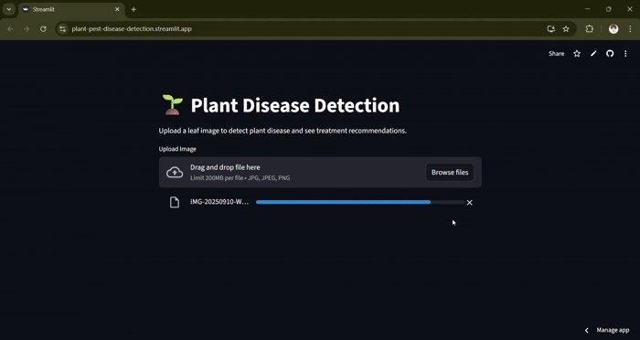

# 🌿 Plant Disease Detection (Deep Learning + FastAPI + Streamlit)

An end-to-end **Plant Disease Detection System** using **PyTorch**, **ResNet-18**, **FastAPI REST API**, and **Streamlit UI**.
Upload a leaf image and instantly receive:

✔ Disease name
✔ Disease description
✔ Chemical treatment recommendations
✔ Bio-organic treatment suggestions
✔ Confidence score

---

## 📺 Live Demo (GIF)

<p align="center">
  
</p>

## ✨ Features

### 🤖 Deep Learning Model

* Fine-tuned **ResNet-18** classifier
* Trained in Google Colab (dataset loading, augmentation, splits, training loops visible in your training PDF)
* Clean prediction formatting
* High-confidence softmax output

### 🚀 FastAPI Backend

* `/predict/` REST endpoint
* Accepts image → returns disease info
* Handles:

  * disease formatting
  * treatment cleaning
  * bio-organic treatment splitting

### 🎨 Streamlit Frontend

* User uploads image
* Displays model output neatly
* Shows treatments as bullet lists
* Clean centered UI

### 📄 Treatment Dataset Integration

* Reads `Treatment_dataset.csv`
* Fetches:

  * disease description
  * chemical treatments
  * bio/organic solutions

---

## 📁 Project Structure

```
📦 plant-disease-detection
├── backend/
│   ├── main.py                 # FastAPI backend
│   ├── plant_disease_model.pth # Trained model
│   ├── Treatment_dataset.csv   # Treatment data
├── frontend/
│   ├── app.py                  # Streamlit UI
├── notebooks/
│   ├── plant_disease_training.pdf
├── assets/
│   ├── plant_disease_demo.gif  # (Add your GIF here)
└── README.md
```

---

## 🧠 Model Training Summary

Your included training notebook (PDF) contains:

### **📌 Dataset Loading**

* Reads plant disease folders
* Maps classes automatically

### **📌 Visualization**

* Displays sample leaves (page 3 of your notebook)

### **📌 Data Splits**

* Train / Test / Validation (stratified)

### **📌 Transformations**

* Resize
* Random Flip
* Random Rotation
* Normalization
* (Same transforms used in prediction)

### **📌 Model Architecture**

* ResNet-18
* Custom final linear layer replacing the original
* Adam optimizer
* CrossEntropyLoss

### **📌 Training Loop**

* Forward → backward → optimizer step
* Epoch logging for training/validation

---

## 🚀 Getting Started

### 1️⃣ Clone the Repository

```
git clone https://github.com/your-username/plant-disease-detection.git
cd plant-disease-detection
```

### 2️⃣ Install Dependencies

```
pip install -r requirements.txt
```

Dependencies include:

```
fastapi
uvicorn
torch
torchvision
pandas
pillow
streamlit
```

---

## 🧪 Running the Backend (FastAPI)

```
cd backend
uvicorn main:app --host 0.0.0.0 --port 8000
```

### API Endpoint Example

**POST /predict/**
Send an image → receive prediction.

**Response:**

```json
{
  "prediction": {
    "disease": "Strawberry - Leaf Scorch",
    "description": "Fungal disease causing brown spots...",
    "treatments": [
      "Copper oxychloride 50% WP",
      "Thiophanate methyl 70% WP"
    ],
    "bio_treatments": [
      "Neem oil 5ml/liter",
      "Trichoderma viride 2g/liter"
    ]
  },
  "confidence": 0.96
}
```

---

## 🎨 Running the Frontend (Streamlit)

```
cd frontend
streamlit run app.py
```

Streamlit UI will open in the browser.

---

## 🛠 Tech Stack

| Component      | Technology                                   |
| -------------- | -------------------------------------------- |
| Model Training | PyTorch                                      |
| Backend        | FastAPI                                      |
| Frontend       | Streamlit                                    |
| Deployment     | Uvicorn / Streamlit Cloud                    |
| Dataset        | Custom Plant Disease Dataset + Treatment CSV |

---


